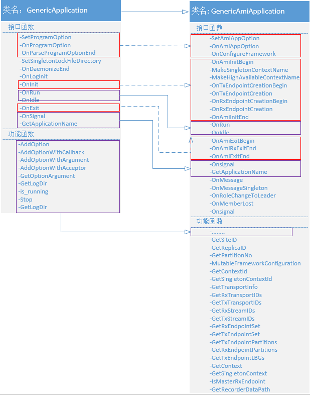
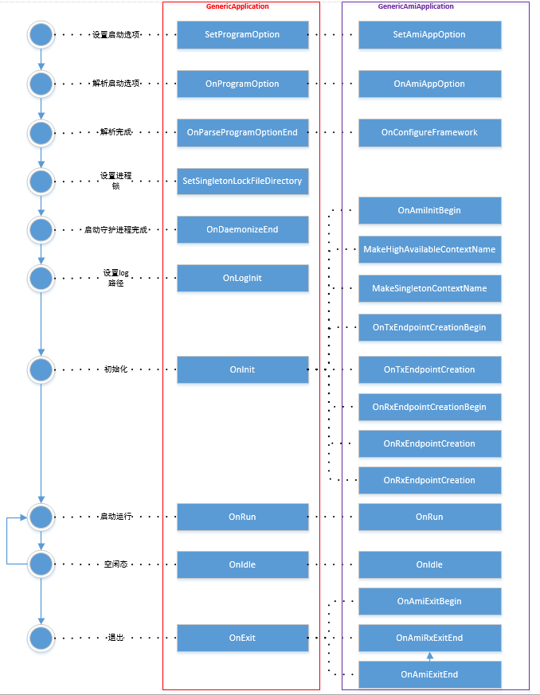
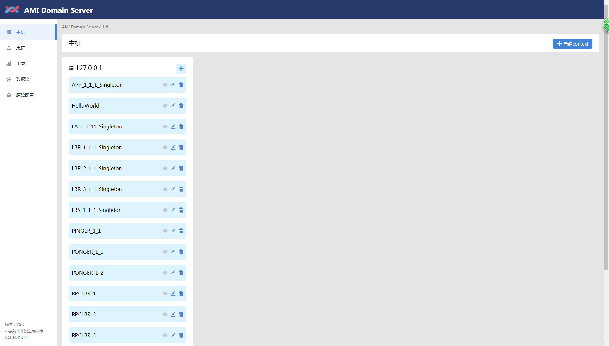
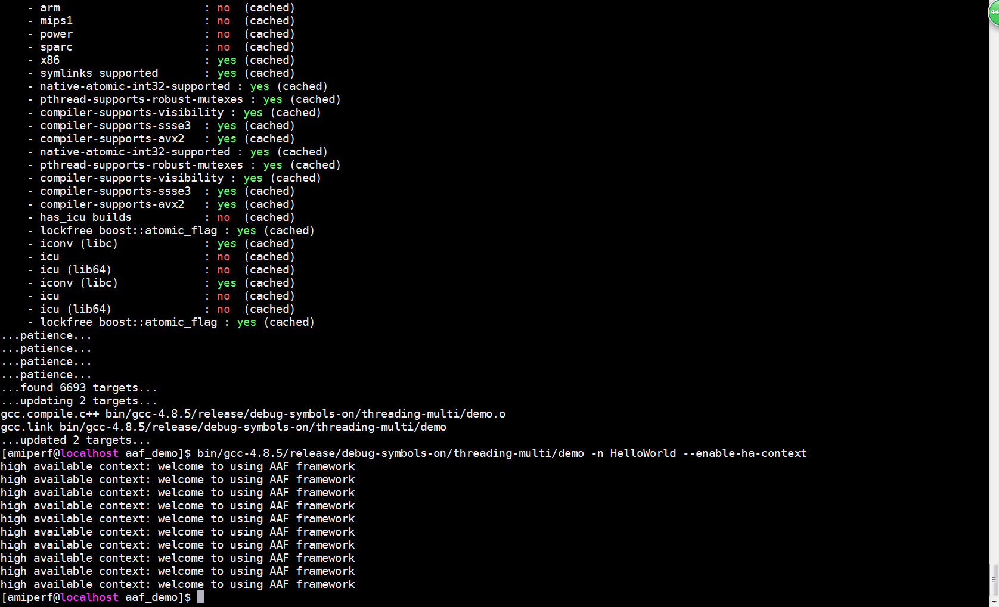

# AAF使用说明书

## AAF框架设计
AAF框架提供了更简单的AMI接入接口、应用日志接口。AAF应用以单例守护进程的形式运行。目前AAF的应用最多只能使用两个AMI Context。一个Context用于组成高可用集群，一个Context用于其它非高可用场景。AAF要求应用名称必须符合以下正则表达式。
> [A-Za-z]+\_[0-9]+\_[0-9]+\_[0-9]

- 该命名规范中，“_”做为分割符
- 第一部分为应用业务功能的缩写
- 第二部分为应用的分区编号
- 第三部分为应用部署的数据中心编号
- 第四部分为应用在同一集群内的副本ID。
- 应用名可以在命令行通过`-n`选项指定

AAF框架默认使用以下Context
> \${app-name}			

- AFF假设以上Context为一个高可用的Context，其上的消息会通过接口`OnMessage()`回调应用
- 对应的Context对象可以通过接口`GetContext`获得
> \${app-name}_Singleton

- AFF假设以上Context为一个单例(非高可用)的Context，其上的消息会通过接口`OnMessageSingleton()`回调应用
- 对应的Context对象可以通过接口`GetSingletonContext`获得

譬如：应用名称为TE_1_1_11，那么高可用的Context为TE_1_1_11，非高可用的Context为TE_1_1_11_Singleton

以上是AAF的默认规则，应用也可以通过接口`MakeSingletonContextName()`和`MakeHighAvailableContextName()`改写AAF所使用的高可用Context和单例Context名称。

应用在运行时使用高可用的Context、单例的Context、亦或两者都使用，可以通过配置AAF的属性来实现。配置AAF属性需在接口`OnConfigureFramework(ami::Property& fw_props)`内进行，目前支持的属性值如下。
> aaf::config::kEnableAppNameCheck - bool型，是否检查应用程序命名规则
> aaf::config::kEnableSingletonContext  - bool型，是否创建单例的Context
> aaf::config::kEnableHighAvailableContext  - bool型，是否创建高可用的Context

AAF会为应用自动生成通用的命令行参数
- `-h` 输出帮助信息
- `-n` 指定应用名
- `--domain-server` 指定DomainServer地址，默认"{localhost:2379}"
- `--log-level` 指定日志级别，默认Info
- `--log-dir`   指定日志存放路径，默认~/log
- `--log-to-console` 日志输出到终端
- `--recorder-data-path` 指定持久化数据的存放路径
- `--init-status` 指定高可用Context初始状态，默认"Bootstrap"
- `--init-status-singleton` 指定单例Context初始状态，默认"Bootstrap"

## AAF框架类图


- 上述AAF类图中，一般程序框架类（GenericApplication）为Server端应用提供了通用的初始化和停止流程，单例进程，守护进程。程序启动后会AAF框架会依次调用各个接口驱动程序的处理过程
- 上述AAF类图中，基于AMI的程序框架类（GenericAmiApplication）在一般程序框架之上，对一般程序框架类提供的接口进行了细化实现，提供了具有AMI特征的初始化和停止流程、消息收发和日志接口。AMI的程序框架类供了一系列的功能函数，方便应用获取AMI Endpoint、Transport、ID、Partition、日志路径等信息。

## 初始化和停止流程



## AAF接口说明

​	安装包内提供了两个demo实例，demo_1主要展示的基于AAF框架编写程序的流程，该实例可满足大多数开发需求；demo_2详细展现了AAF框架的各个接口和功能函数的使用方法。请参考一下接口说明阅读demo代码。

```c++
SetAmiAppOption();
```
> 该函数是AAF初始化之前提供给用户添加自定义启动选项的接口。可通过AAF框架提供的功能函数来添加；例如AddOption，AddOptionWithArgument，AddOptionWithAcceptor等。实例demo_2演示了所有功能接口的使用方法，详见下节分析。

```c++
OnAmiAppOption(const std::string& option_name)
```

> 该函数是AAF解析完启动参数后，提供给用户读取选项值的接口。AAF框架会根据参数列表依次调用该函数，用户可根据option_name判断参数名称，可通过功能函数GetOptionArgument获取对应参数的值，或者执行其他操作。

```c++
OnConfigureFramework(ami::Property& fw_props）
```

> 该函数是AAF解析完所有命令行选项之后，提供给应用来配置AAF属性的接口，这些属性主要是对AMI的相关设置，具体属性详见头文件config_key.h。例如实例设置的kEnableHighAvailableContext属性表示是否创建高可用context，kEnableAppNameCheck属性表示是否对实例名进行规则检查。

```c++
OnAmiInitBegin()
```

>该函数是在初始化AMI之前通知用户的接口，告知用户即将初始化AMI，AMI所需的必要配置都必须在此完成。若无其他配置操作，则可以不用重写该接口。

```c++
 MakeSingletonContextName() / MakeHighAvailableContextName()
```

>该函数是AMI初始化的第一步，通知用户设置所要创建Context名称的接口。如果不重写该接口，AAF会使用 默认context名称。即高可用context为“实例名”，非高可用context为“实例名 + _Singleton”。

```c++
OnTxEndpointCreationBegin()
```

> 该函数是AMI创建所有TxEndpoint之前通知用户的接口，告知用户即将创建所有的TxEndpoint。用户可在此 使用功能函数GetTxEndpointSet获取要创建的TxEndpoint名称。

```c++
OnTxEndpointCreation(EndpointHandler* ep_hdl, const std::string& ep_name)
```

> 该函数是AMI创建一个TxEndpoint结束后通知用户的接口，告知用户创建的TxEndpoint名称为ep_name，以及该TxEndpoint使用的消息处理句柄是ep_hdl。如果有多个TxEndpoint需要创建，则依次调用该函数，直至所有的TxEndpoint创建完成。用户可在此获取并保存每个TxEndpoint的相关信息。

```c++
OnRxEndpointCreationBegin()
```

> 该函数是AMI创建完所有TxEndpoint之后，在创建所有RxEndpoint之前通知用户的接口，告知用户即将创建所有的RxEndpoint。用户可在此使用GetRxEndpointSet功能函数获取RxEndpoint名称。（注意AMI在初始化时，先创建TxEndpoint，再创建RxEndpoint；AMI退出时，顺序刚好相反）

```c++
OnRxEndpointCreation(const std::string& ep_name, ami::MessageHandler** msg_hdl, bool is_ha_ctx)
```

> 该函数是AMI创建一个RxEndpoint之前通知用户的接口，告知用户即将创建名为ep_name的RxEndpoint，是否要为其设置一个消息处理句柄msg_hdl，如果不设置，则使用AMI默认的消息处理句柄，即AAF提供的接口OnMessage/OnSingletonMessage，如果有多个RxEndpoint需要创建，则依次调用该函数，直至所有的RxEndpoint创建完成。用户可在此获取并保存每个RxEndpoint的相关信息。

```c++
OnAmiInitEnd()
```

> 该函数是AMI初始化完成之后通知用户的接口。告知用户AMI已经初始化完成，即将要启动程序开始处理逻辑，整个程序所有的初始化工作都应该在该接口调用完成前结束。该函数是通知用户AMI已经初始化完成，即将开始启动程序处理逻辑，所有的初始化操作必须在此完成。

```c++
OnRun()	
```

> 应用主线程的运行接口，若应用可以持续运行，AAF框架会持续调用改接口。

```c++
OnIdle()
```

> 程序空闲态处理流程的接口。当OnRun成功结束时，程序进入空闲态。程序空闲态处理流程结束，程序会通过is_running判断程序状态，如果程序仍处于运行态，则继续进入OnRun处理；否则会进入退出流程。一般OnIdle仅等待或log打印，不需要做过多操作。

```c++
OnAmiExitBegin()
```

> AMI开始退出。程序开始清空资源。

```c++
OnAmiRxExitEnd()
```

> 退出RxEndpoint完成。RxEndpoint 和TxEndpoint初始化顺序和退出顺序相反。

```c++
OnAmiExitEnd()
```

> 该函数是通知用户AMI退出完成的接口。程序所有的资源需要在此清空完成。

```c++
OnMessageSingleton(ami::Message* msg) / OnMessage(ami::Message* msg)
```

> 该函数是AAF提供的默认的RxEndpoint消息处理接口，如果用户在创建RxEndpoint时未定义消息处理句柄，则使用该接口处理ami消息。当RxEndpoint有消息接收，ami会调用该函数，将主题上的消息交给应用。前者是非高可用情景，后者是高可用情景。

```c++
OnRoleChangeToLeader() / OnMemberLost()
```

> AMI集群事件通知接口。程序在初始化AMI过程中，AMI会确定该实例的集群角色，如果该实例是主机，则会使用OnRoleChangeToLeader接口通知用户。如果有集群成员退出集群，则会通过OnMemberLost接口通知用户。

```c++
OnSingnal(int sig_num, int value)
```

>程序接收到SIGUSR1和SIGUSR2信号通知用户的接口。AAF向操作系统注册了处理SIGUSR1和SIGUSR2信号的处理函数，当程序接收到SIGUSR1和SIGUSR2信号会调用信号处理函数。用户可在该接口内根据信号值处理这两个信号。
>
>AAF实现了对SIGUSR1部分信号值的处理：当SIGUSR1信号值为1：进入程序退出流程；SIGUSR1信号值为2,3,4：修改log打印级别分别为TRACE，DEBUG，INFO。

## 演示demo
### 编译demo
- `cd ami_install_package/install_package/script; source setup_env.sh`
- `cd ami_install_package/install_package/example/aaf/aaf_demo`
- `b2 demo -j4`

### 配置demo
- 启动DomainServer `cd ami_install_package/install_package/script; source setup_env.sh; ./etcd_init.sh`
- 访问DomainServer主机IP，端口5001可以看到如下内容


### 运行demo
- 使用`-h`选项查看demo启动选项
- 使用`-n`指定Context名称，这里我们使用Context "HelloWorld"，该Context会使用主题"Loop"回环发送
- 使用`--domain-server`指定DomainServer的地址，这里DomainServer启动在同一主机，且使用默认端口2379，因此无需指定
- 使用`--enable-ha-context`告诉框架，创建高可用的AMI Context
- 应用启动命令如下
  `cd ami_install_package/install_package/example/aaf/aaf_demo`
  `bin/gcc-4.8.5/release/debug-symbols-on/threading-multi/demo -n HelloWorld --enable-ha-context`



**注意:** 
- 这里虽然使用高可用的Context，但是Context最终是否为高可用，是由DomainServer中Context的属性决定的，并不由框架的决定。框架会为AMI认为的Context指定回调接口OnMessage()，会为应用认为的单例Context指定回调接口OnMessageSingleton()
- 若发生错误，可以查看应用日志，日志位于`~/log/log_HelloWrold_*.log`，日志的名称中带有应用名(`-n`指定)

## AAF工具

​	为测试用户基于AAF编写的程序，AAF工具集中提供了三个测试工具。

1. 消息发送器 — ami_transmitter 

   该工具用于向主题发送消息，测试程序是否能正常从主题接收数据并处理。可以使用-h选项查看用法

2. 消息接收器 — ami_receiver

   该工具用于接收主题消息，测试程序是否成功将消息发送到对应主题上。可以使用-h选项查看用法。

3. 信号发送器 — send_usr1

   该工具是用于向程序发送SIGUSR1信号，测试程序是否正常退出。可以使用-h选项查看用法。

   ​