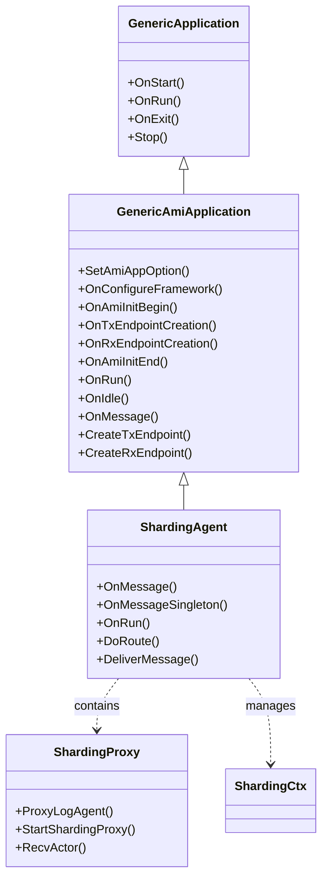
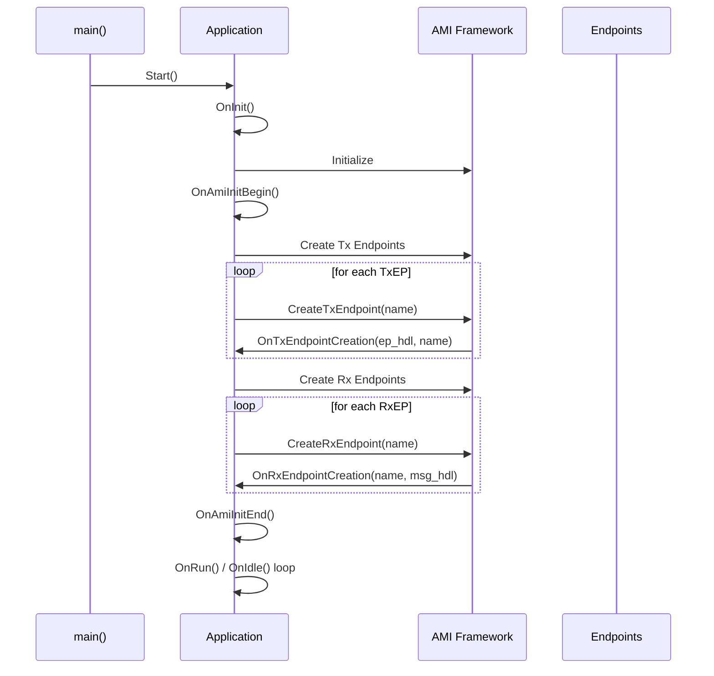
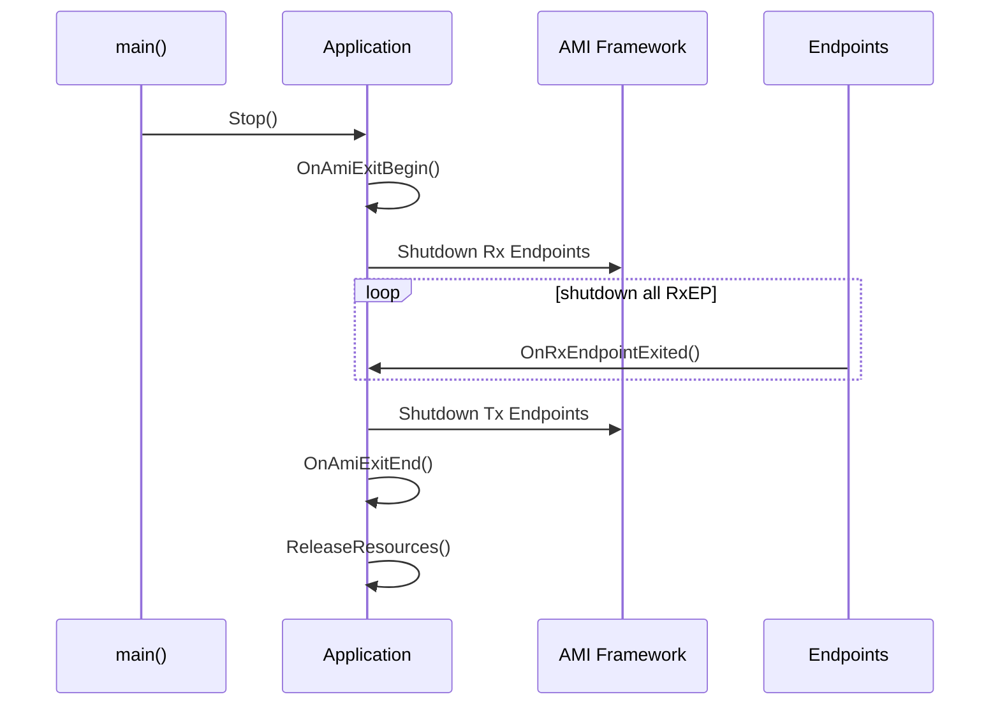

# AAF (AMI Application Framework) 技术实现分析报告

## 1. 概述

AAF (AMI Application Framework) 是一个基于 AMI (Advanced Messaging Infrastructure) 构建的高性能应用框架，专注于分布式系统的应用层开发。本文件详细分析 AAF 的代码结构、模块关系及技术特点。

---

## 2. 工程结构与模块划分

### 2.1 整体架构

```
AAF 工程结构：
├── include/                  # 头文件目录
│   └── aaf/                 # AAF 公共头文件
│       ├── generic_application.h     # 基础应用类
│       ├── generic_ami_application.h # AMI 应用基类
│       ├── error_code.h          # 错误码定义
│       ├── config_key.h          # 配置键值
│       ├── log_define.h          # 日志定义
│       └── sharding_*            # 分片相关模块
│
├── src/                    # 源代码目录
│   ├── generic_application.cpp      # 基础应用实现
│   ├── generic_ami_application.cpp  # AMI 应用核心实现
│   ├── async_ami_executor.h         # 异步执行器
│   └── ...                         # 其他辅助模块
│
├── sharding/               # 分片功能模块
│   ├── sharding_agent.h           # 分片代理核心
│   ├── sharding_proxy.h           # 分片代理服务
│   ├── sharding_channel.h         # 分片通信通道
│   ├── ami_message.h              # AMI 消息封装
│   ├── protocol.h                 # 协议定义
│   ├── constant.h                 # 常量定义
│   ├── reorder_buffer.h           # 乱序缓冲区
│   ├── seq_lock.h                 # 序列号锁
│   └── util.h                     # 工具函数
│
├── tools/                  # 工具程序
│   ├── ami_bridge/          # AMI 桥接工具
│   ├── ami_recorder/        # AMI 录制工具
│   └── ami_record_tool/     # AMI 回放工具
│
└── example/                # 示例代码
    ├── demo.cpp             # 基础示例
    ├── demo2.cpp            # 进阶示例
    └── follower_demo.cpp    #  follower 模式示例
```

### 2.2 核心模块详解

#### 2.2.1 基础应用模块 (Base Application)

**GenericApplication** (`generic_application.h/cpp`)
- **职责**: 应用程序的基础入口点
- **核心功能**:
  - 程序生命周期管理 (启动、运行、退出)
  - 命令行参数解析
  - 日志系统初始化
  - 信号处理

**GenericAmiApplication** (`generic_ami_application.h/cpp`)
- **职责**: AAF 应用的核心基类，继承自 GenericApplication
- **核心接口**:
  ```cpp
  virtual int32_t OnAmiInitBegin();           // AMI 初始化前
  virtual int32_t OnTxEndpointCreationBegin(); // TxEndpoint 创建前
  virtual int32_t OnTxEndpointCreation(...);   // 创建 TxEndpoint 后
  virtual int32_t OnRxEndpointCreationBegin(); // RxEndpoint 创建前
  virtual int32_t OnRxEndpointCreation(...);   // 创建 RxEndpoint 后
  virtual int32_t OnAmiInitEnd();              // AMI 初始化完成后
  virtual int32_t OnRun();                     // 主循环
  virtual void OnIdle();                       // 空闲态
  virtual void OnMessage(ami::Message* msg);   // 高可用消息处理
  virtual void OnMessageSingleton(ami::Message* msg); // 单例消息处理
  virtual void OnRoleChangeToLeader();         // 角色切换为 Leader
  virtual void OnRecoveryBegin();              // 恢复开始
  virtual void OnRecoverySuccess();            // 恢复成功
  ```

#### 2.2.2 分片模块 (Sharding)

**ShardingAgent** (`sharding/sharding_agent.h/cpp`)
- **职责**: 分片代理的核心逻辑控制器
- **核心特性**:
  - 多分片管理 (支持最多 kMaxShardingNum 个分片)
  - 高性能消息路由 (`DoRoute` 虚函数调用用户自定义路由逻辑)
  - 顺序消息处理 (ReorderBuffer)
  - 序列号锁机制 (ShardingSeqLock)
  
**关键方法**:
```cpp
void OnMessage(ami::Message* msg) override {
    // 1. 调用用户定义的 DoRoute 进行分片路由
    int32_t sharding_dst = aaf_instance_->DoRoute(msg, sharding_num_);
    
    // 2. 根据路由结果分发到对应分片上下文
    if (is_advance_follower_) {
        DeliverFlrMessage(msg, sharding_ctx_vec_[sharding_dst], ts_begin);
    } else {
        DeliverMessage<false>(msg, sharding_ctx_vec_[sharding_dst], ts_begin);
    }
}
```

**ShardingProxy** (`sharding/sharding_proxy.h/cpp`)
- **职责**: 分片代理服务，负责进程间通信和数据转发
- **实现方式**:
  - 使用 shared memory 实现高效数据共享
  - 通过 pipe 进行线程间通信
  - 提供独立的日志线程

**ShardingChannel** (`sharding/sharding_channel.h`)
- **职责**: 分片间的通信通道
- **实现**: 基于共享内存的消息通道

#### 2.2.3 消息处理模块

**AMI Message 封装** (`sharding/ami_message.h`)
- 包装标准 AMI 消息
- 添加分片相关信息
- 零拷贝优化

**Protocol 定义** (`sharding/protocol.h`)
- 定义分片间通信协议格式
- 包括 header、body 等结构

**ReorderBuffer** (`sharding/reorder_buffer.h`)
- **职责**: 处理乱序到达的消息
- **实现**: 
  - 维护 sequence number
  - 按序递送消息给上层应用

**SeqLock** (`sharding/seq_lock.h`)
- **职责**: 序列号级别的锁机制
- **技术特点**:
  - 自旋锁实现 (boost::detail::spinlock)
  - 支持细粒度的并发控制
  - 适用于高并发场景

#### 2.2.4 共享内存管理

**ShardingShmManager** (`sharding_shm_manager.h`)
- **职责**: 共享内存管理器
- **功能**:
  - 创建和管理共享内存段
  - 分配和释放内存块
  - 跨进程数据共享

#### 2.2.5 辅助工具模块

**AsyncAmiExecutor** (`async_ami_executor.h`)
- **职责**: 异步任务执行器
- **用途**: 将耗时的业务逻辑异步化处理，避免阻塞主循环

**ConfigKey** (`config_key.h`)
- **用途**: 定义所有可用的配置键名
- **分类**:
  - 框架配置
  - 网络配置
  - 分片配置
  - HA 配置

---

## 3. 核心类关系图



---

## 4. 技术实现特点

### 4.1 设计模式

#### 4.1.1 模板方法模式 (Template Method Pattern)
- **位置**: `GenericAmiApplication` 的虚函数设计
- **实现**: 
  - 定义了应用生命周期的骨架流程
  - 通过虚函数让用户扩展特定阶段的逻辑
  - 典型实现：
    ```cpp
    // 框架控制的启动流程
    virtual void Start() {
        OnInit();
        OnAmiInitBegin();
        CreateEndpoints();
        OnAmiInitEnd();
        while(is_running()) {
            OnRun();
            OnIdle();
        }
        OnAmiExitBegin();
    }
    ```

#### 4.1.2 策略模式 (Strategy Pattern)
- **位置**: `DoRoute()` 虚函数
- **实现**: 
  - 允许用户自定义分片路由算法
  - 框架不限制路由逻辑的具体实现
  ```cpp
  // 用户可以重写此函数实现自定义路由
  virtual int32_t DoRoute(ami::Message* msg, uint32_t sharding_num) {
      // 用户自定义路由逻辑
      return hash(msg) % sharding_num;
  }
  ```

### 4.2 高性能优化技术

#### 4.2.1 零拷贝传输
- **应用场景**: 消息发送
- **实现方式**: 
  - 使用 `ami::Message::NewMessage` 直接申请缓冲
  - 在缓冲中填充数据，无需额外复制

#### 4.2.2 共享内存通信
- **应用场景**: 分片间数据共享
- **优势**:
  - 避免了进程间的数据拷贝
  - 大幅提升吞吐量

#### 4.2.3 批量处理
- **应用场景**: 消息投递
- **实现**: 
  - 在 `DeliverMessage` 中批量处理消息
  - 减少系统调用次数

### 4.3 并发控制技术

#### 4.3.1 线程安全保证
- **自旋锁**: `boost::detail::spinlock` 用于保护共享数据
- **原子操作**: 对计数器使用原子操作避免锁竞争

#### 4.3.2 无锁队列
- **SPSCQueue**: 单生产者单消费者队列
- **应用场景**: 消息排序队列
- **优势**: 完全无锁，性能极高

### 4.4 容错与恢复机制

#### 4.4.1 高可用 (HA) 支持
- **Context 类型**: 区分 HA Context 和 Singleton Context
- **角色管理**: Leader/Follower/Master 状态机
- **事件通知**: 
  ```cpp
  virtual void OnRoleChangeToLeader();
  virtual void OnMemberLost(const std::vector<std::string>& lost_members);
  virtual void OnRecoveryBegin();
  virtual void OnRecoverySuccess();
  ```

#### 4.4.2 断点续传
- **Sequence Number**: 消息全局序列号
- **CheckPoint**: 定期保存处理进度
- **Recovery**: 从断点恢复数据处理

---

## 5. 关键数据结构

### 5.1 ShardingCtx (分片上下文)
```cpp
struct ShardingCtx {
    EndpointHandler* tx_ep_hdl;     // 发送端句柄
    ami::MessageHandler* rx_handler; // 接收处理器
    ShmContMem* shm_memory;         // 共享内存指针
    int32_t pipe_fd[2];             // 管道描述符
    // ... 更多字段
};
```

### 5.2 ShmTxMessage / ShmRxMessage
```cpp
struct ShmTxMessage {
    msg_header_t header;            // 消息头
    // 可拓展业务数据
};

struct ShmRxMessage {
    msg_header_t header;
    uint32_t endpoint_id;
    uint32_t partition_no;
    uint64_t total_order_sqn;
    char msg_body[];                // 变长消息体
};
```

### 5.3 ReorderBuffer (乱序缓冲区)
```cpp
class ReorderBuffer {
private:
    std::map<int64_t, ami::Message*> pending_msgs_; // 未就绪消息
    int64_t next_expected_seq_;                      // 下一个期望的序列号
public:
    bool insert(int64_t seq, ami::Message* msg);    // 插入消息
    void flushReadyMessages(std::vector<ami::Message*>& out); // 输出就绪消息
};
```

---

## 6. 生命周期管理

### 6.1 应用启动流程



### 6.2 优雅退出流程



---

## 7. 异常处理机制

### 7.1 错误码体系
- **位置**: `error_code.h`
- **分类**:
  - 成功：`ErrorCode::kSuccess = 0`
  - 失败：`ErrorCode::kFailure = -1`
  - 传递：`ErrorCode::kPassed = 1`
  - 业务错误：`10000-19999`
  - 框架错误：`20000-29999`
  - 网络错误：`30000-39999`

### 7.2 异常捕获策略
- **try-catch 包裹**: 所有用户回调函数都有异常保护
- **日志记录**: 捕获异常后记录详细堆栈信息
- **容错处理**: 单个消息处理失败不影响整体运行

---

## 8. 日志系统

### 8.1 日志级别
- `ADK_LOG_TRACE`: 跟踪级 (最详细)
- `ADK_LOG_DEBUG`: 调试级
- `ADK_LOG_INFO`: 信息级
- `ADK_LOG_WARN`: 警告级
- `ADK_LOG_ERROR`: 错误级
- `ADK_LOG_FATAL`: 致命级

### 8.2 AC (Activity Context) 日志
- **带上下文追踪**: `ADK_LOG_INFO_AC_TF`
- **用途**: 关联同一请求的不同日志
- **实现**: 基于 thread_local 存储 context id

---

## 9. 总结

AAF 框架的技术特点可以总结为：

1. **分层架构清晰**: 基础层→AMI 层→分片层，职责明确
2. **高性能设计**: 零拷贝、共享内存、无锁队列等技术广泛应用
3. **容错能力强**: HA 支持、断点续传、异常处理完善
4. **扩展性好**: 虚函数设计让用户可以轻松定制行为
5. **生产级质量**: 完善的日志、监控、统计功能

这些特点使得 AAF 非常适合构建大规模分布式系统中的应用服务。

---

## 附录：核心头文件索引

| 文件名 | 核心类/函数 | 说明 |
|--------|-----------|------|
| `generic_application.h` | GenericApplication | 应用基类 |
| `generic_ami_application.h` | GenericAmiApplication | AMI 应用基类 |
| `sharding_agent.h` | ShardingAgent | 分片代理 |
| `sharding_proxy.h` | ShardingProxy | 分片服务 |
| `sharding_channel.h` | ShardingChannel | 通信通道 |
| `seq_lock.h` | ShardingSeqLock | 序列锁 |
| `reorder_buffer.h` | ReorderBuffer | 乱序缓冲 |
| `error_code.h` | ErrorCode | 错误码 |
| `config_key.h` | ConfigKey | 配置项 |
