# AAF (AMI Application Framework) 数据流转分析报告

## 1. 概述

本文档从数据流转的角度，详细分析 AAF 框架中不同类型的数据如何在各个组件间流动，包括消息流、控制流、事件流等关键数据路径。

---

## 2. 数据流类型

AAF 中的数据流主要分为以下几类：

1. **业务消息流**: 应用程序间的正常业务数据
2. **控制消息流**: HA 集群控制的信令数据
3. **事件通知流**: 生命周期事件和状态变更通知
4. **日志数据流**: 运行日志和统计指标
5. **检查点数据流**: 断点续传的状态保存

---

## 3. 核心数据流转路径

### 3.1 接收消息处理流程 (Receive Path)

这是最重要的数据流，描述了消息从网络到达应用处理的完整路径。

#### 3.1.1 高可用 (HA) 场景消息流

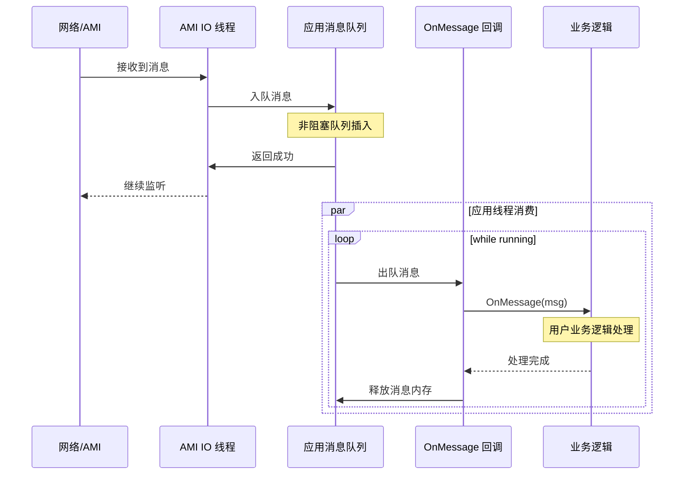

**详细步骤说明**:

```cpp
// 阶段 1: AMI IO 线程接收
void AmiIoHandler::OnRead(ami::Message* msg) {
    // 1. AMI 接收网络消息
    // 2. 创建 Message 对象
    // 3. 放入应用消息队列 (SPSC 队列)
    app_msg_queue_->Push(msg);
}

// 阶段 2: 应用线程消费
void GenericAmiApplication::ProcessMessages() {
    while (is_running()) {
        // 1. 从队列获取消息 (非阻塞)
        ami::Message* msg = app_msg_queue_->Pop();
        
        if (msg != nullptr) {
            // 2. 调用用户的消息处理函数
            OnMessage(msg);  // HA context
            
            // 3. 业务逻辑执行完成
            // 4. 释放消息资源
            DeleteMessage(ep_hdl, msg);
        } else {
            // 队列为空，进入休眠或轮询
            usleep(idle_delay_microsec_);
        }
    }
}
```

#### 3.1.2 分片 (Sharding) 场景消息流

分片场景更加复杂，涉及多进程、共享内存等机制。

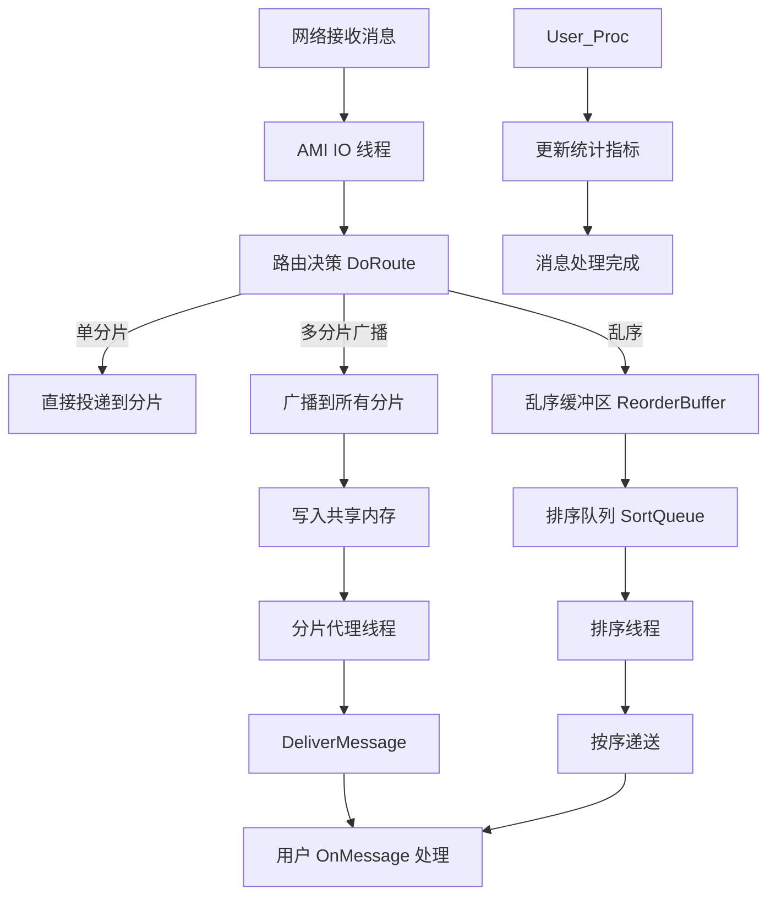

**关键实现细节**:

```cpp
// ShardingAgent::OnMessage 实现
void ShardingAgent::OnMessage(ami::Message* msg) {
    int64_t ts_begin;
    if (is_calc_msg_latency_) {
        ts_begin = adk::timespec_now();  // 记录时间戳用于延迟计算
    }
    
    // 1. 调用用户自定义的分片路由逻辑
    int32_t sharding_dst = aaf_instance_->DoRoute(msg, sharding_num_);
    
    // 2. 路由异常检测
    if (sharding_dst > sharding_num_ || sharding_dst < 0) {
        ++(ctx_ind_[0].nr_route_failed);  // 统计路由失败
        return;
    }
    
    // 3. 根据路由结果分发
    if (ADK_LIKELY(sharding_dst > 0)) {
        // 单分片场景
        if (is_advance_follower_) {
            // 提前 follower 模式：推送到实时处理和 trial 两个进程
            DeliverFlrMessage(msg, sharding_ctx_vec_[sharding_dst], ts_begin);
        } else {
            // 标准模式：推送到对应分片上下文
            DeliverMessage<false>(msg, sharding_ctx_vec_[sharding_dst], ts_begin);
        }
        ++(ctx_ind_[0].nr_message_received);
        return;
    }
    
    if (sharding_dst == 0) {
        // 广播到所有分片
        for (int sharding_index = 1; sharding_index <= sharding_num_; ++sharding_index) {
            DeliverMessage<true>(msg, sharding_ctx_vec_[sharding_index], ts_begin);
        }
        ++(ctx_ind_[0].nr_message_received);
    }
}
```

### 3.2 发送消息处理流程 (Send Path)

#### 3.2.1 标准发送流程

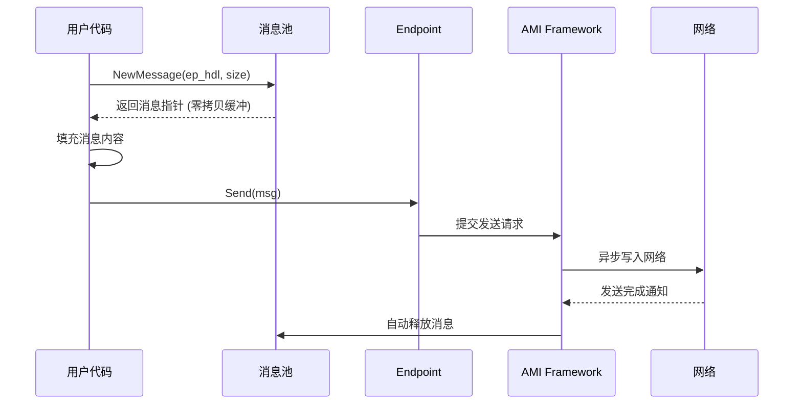

**关键代码**:

```cpp
// 创建消息 (零拷贝)
ami::Message* msg = GenericAmiApplication::NewMessage(ep_hdl, buffer_size);

// 填充消息体 (直接在缓冲上操作)
memcpy(msg->data(), user_buffer, buffer_size);
msg->set_data_len(buffer_size);

// 发送消息
ep_hdl.context_->SendMessage(msg);

// 注意：发送成功后消息由 AMI 自动释放，无需手动删除
```

#### 3.2.2 分片发送流程

分片场景下，发送需要通过共享内存进行跨进程通信。

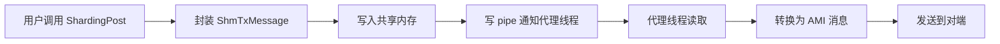

```cpp
// ShardingAgent::ShardingPost 实现
int32_t ShardingAgent::ShardingPost(const void* data, uint32_t size, 
                                     int32_t sharding_index) {
    // 1. 分配共享内存槽位
    auto& shm_data = sharding_ctx_vec_[sharding_index]->shm_tx_memory;
    
    // 2. 封装成 ShmTxMessage 结构
    struct ShmTxMessage* tx_msg = reinterpret_cast<ShmTxMessage*>(shm_data.buffer);
    tx_msg->header.msg_type = ShmMsgType::kAmiTxMsg;
    tx_msg->header.msg_len = sizeof(struct ShmTxMessage) + size;
    memcpy(tx_msg->msg_body, data, size);
    
    // 3. 通过 pipe 通知代理线程有新消息
    PipeWrite(reinterpret_cast<char*>(tx_msg), tx_msg->header.msg_len);
    
    // 4. 等待代理线程处理完成
    // ...
}
```

### 3.3 配置加载流程

```mermaid
sequenceDiagram
    participant Main as main()
    participant App as Application
    participant CmdLine as 命令行解析
    param Prop as Property 容器
    param AMI as AMI Framework
    param Etcd as etcd 配置服务器
    
    Main->>App: Start(argc, argv)
    App->>CmdLine: ParseArguments()
    CmdLine-->>App: 获取配置参数
    
    alt 有本地配置
        App->>Prop: LoadLocalConfig()
    else 使用远程配置
        App->>Etcd: Connect and Fetch
        Etcd-->>App: 返回配置 JSON
        App->>Prop: ParseJSON()
    end
    
    App->>App: OnConfigureFramework(props)
    Note over App, Prop: 用户可以修改框架配置
    App->>AMI: Initialize(props)
    AMI->>AMI: 应用配置初始化
    AMI-->>App: 初始化完成
```

---

## 4. 共享内存数据流

### 4.1 共享内存布局

```
共享内存区域 (Shared Memory Region)
├── Header (固定大小)
│   ├── magic_number
│   ├── version
│   └── total_size
│
├── Control Area (控制区)
│   ├── produce_nr (生产计数器)
│   ├── consume_nr (消费计数器)
│   └── sequence_counter
│
├── Message Queue (消息队列区)
│   ├── Slot 1
│   │   ├── header (message_header_t)
│   │   │   ├── msg_type
│   │   │   ├── msg_len
│   │   │   └── flags
│   │   └── body (变长数据)
│   ├── Slot 2
│   └── ...
│
└── Metadata Area (元数据区)
    └── 锁信息、序列号映射表等
```

### 4.2 生产者 - 消费者模型

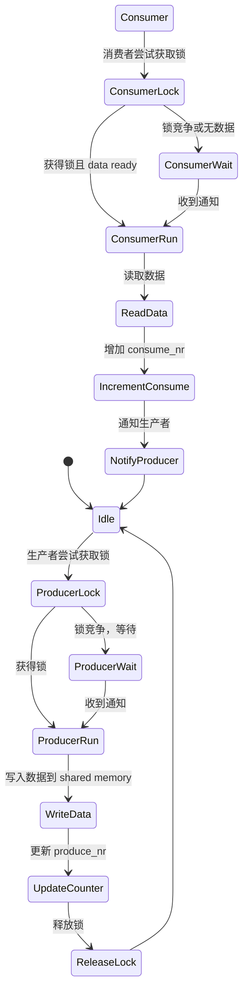

**实现示例**:

```cpp
// 生产者 (发送端)
bool ProduceToShm(const void* data, uint32_t len) {
    boost::mutex::scoped_lock lock(mutex_);
    
    // 检查是否有足够空间
    if (!HasFreeSpace(len)) {
        return false;
    }
    
    // 写入数据
    char* ptr = GetWritePtr();
    memcpy(ptr, data, len);
    
    // 更新生产者计数
    produce_nr_.fetch_add(1);
    
    // 唤醒消费者
    notify_consumer();
    
    return true;
}

// 消费者 (接收端)
bool ConsumeFromShm(void* out_data, uint32_t* out_len) {
    boost::mutex::scoped_lock lock(mutex_);
    
    // 等待数据就绪
    while (produce_nr_ == consume_nr_) {
        if (!try_wait_for(100us)) {
            return false;
        }
    }
    
    // 读取数据
    char* ptr = GetReadPtr();
    *out_len = read_header()->msg_len;
    memcpy(out_data, ptr, *out_len);
    
    // 更新消费者计数
    consume_nr_.fetch_add(1);
    
    // 唤醒生产者
    notify_producer();
    
    return true;
}
```

---

## 5. 事件通知数据流

### 5.1 HA 事件通知

当 HA 集群状态变化时，会通过事件通知应用。

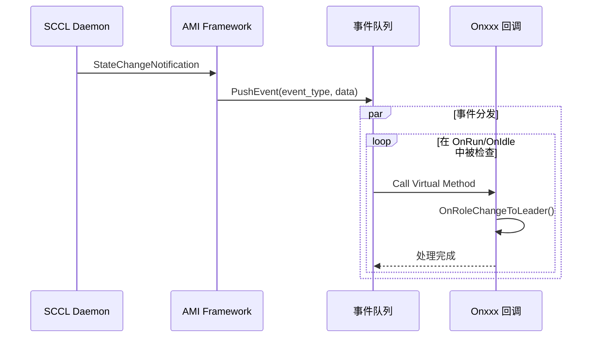

**典型事件流**:

```cpp
// 事件发生
void ScclEventHandler::OnStateChange(RoleType new_role) {
    // 1. 构造事件数据
    ShmAmiEvent event;
    event.type = ShmEventType::kOnRoleChangeToMaster;
    event.prop_str = "new_role=master";
    
    // 2. 推送到事件通道
    event_channel_->Push(event);
}

// 应用接收并处理
void ShardingAgent::OnRoleChangeToMaster() {
    // 用户可以在这里更新本地状态
    // 例如：切换为主动服务模式
}
```

### 5.2 信号处理数据流

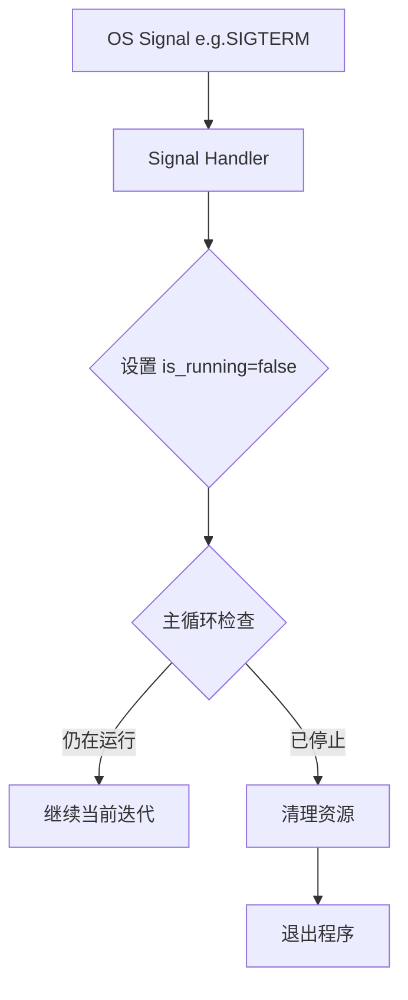

---

## 6. 检查点 (Checkpoint) 数据流

### 6.1 Checkpoint 写入流程

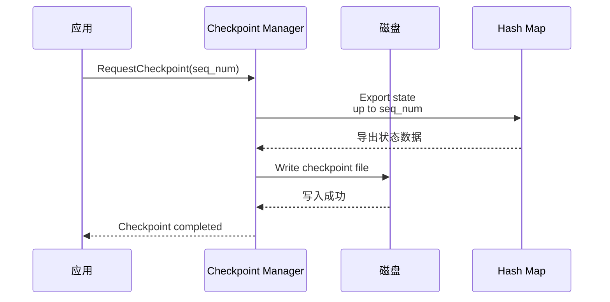

**关键实现**:

```cpp
// 周期性触发检查点
void CheckpointManager::PeriodicCheckpoint() {
    while (running_) {
        sleep(checkpoint_interval_sec_);
        
        // 1. 获取当前已处理的最大序列号
        int64_t last_seq = GetLastProcessedSeq();
        
        // 2. 导出数据状态
        std::string state_data = ExportState(last_seq);
        
        // 3. 序列化并写入文件
        WriteToFile(checkpoint_path_, last_seq, state_data);
        
        // 4. 更新元数据
        UpdateMetaFile(last_seq);
    }
}
```

### 6.2 Checkpoint 恢复流程

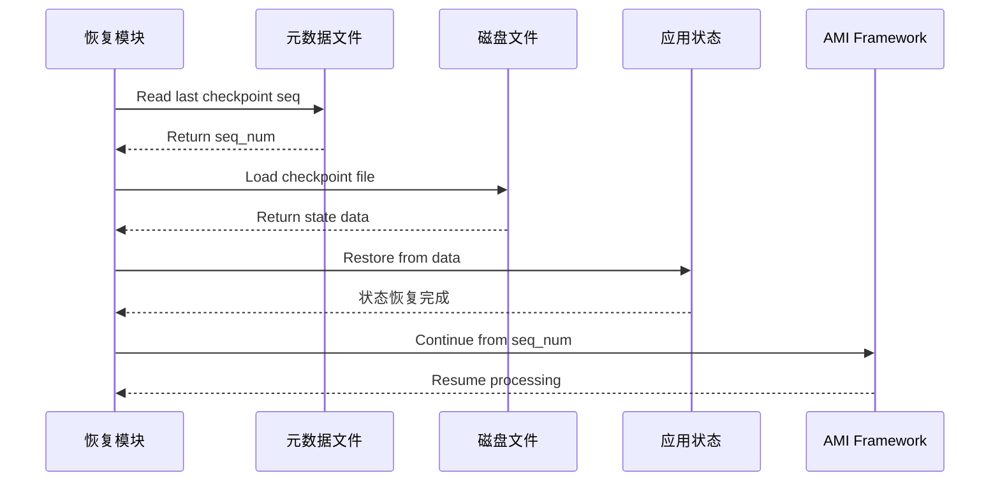

```cpp
// 恢复逻辑
bool RecoveryModule::RestoreFromCheckpoint() {
    // 1. 读取元数据找到最后一个检查点序列号
    int64_t last_seq = MetaReader::ReadLastSequence();
    if (last_seq < 0) {
        return false;  // 无检查点
    }
    
    // 2. 加载对应的 checkpoint 文件
    CheckpointFile cp_file(last_seq);
    std::string state_data = cp_file.ReadState();
    
    // 3. 反序列化并恢复到应用状态
    StateRestorer::Restore(state_data);
    
    // 4. 通知 AMI 从此序列号继续
    AMIResume::SetSequence(last_seq);
    
    return true;
}
```

---

## 7. 日志数据流

### 7.1 日志生成与写入

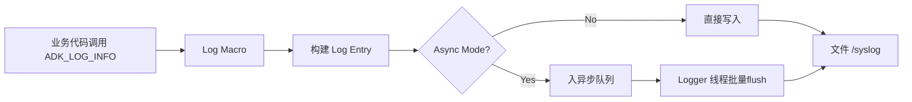

### 7.2 指标收集 (Indicator Collection)

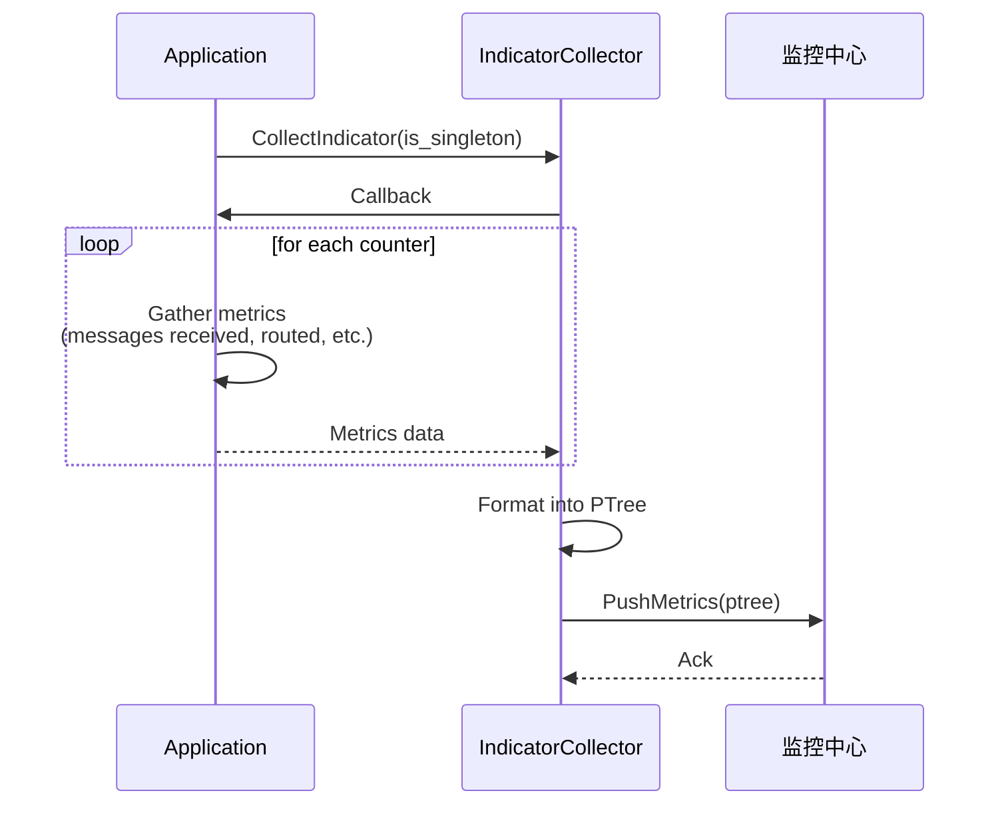

---

## 8. 错误反馈数据流

### 8.1 错误上报路径

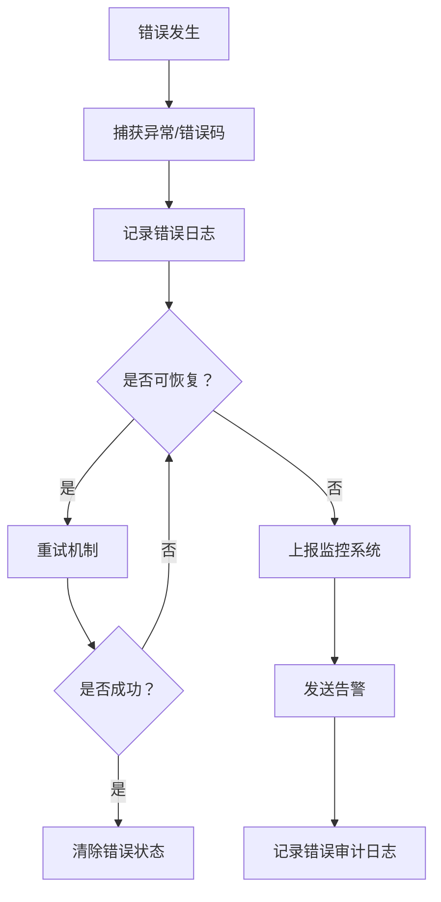

---

## 9. 性能相关数据流优化

### 9.1 延迟测量

在关键节点插入时间戳，形成完整的延迟追踪链：

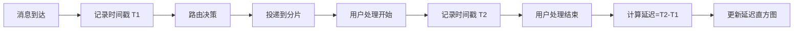

**实现**:

```cpp
// 在 OnMessage 入口处打点
void ShardingAgent::OnMessage(ami::Message* msg) {
    int64_t ts_begin = 0;
    if (is_calc_msg_latency_) {
        ts_begin = adk::timespec_now();  // 记录消息到达时间
    }
    
    // ... 路由逻辑 ...
    
    // 在 DeliverMessage 中也会打点，计算端到端延迟
    DeliverMessage(msg, ctx, ts_begin);
}

// 延迟统计更新
void LatencyMetric::RecordLatency(int64_t latency_us) {
    lock_guard_<spinlock> lock(stats_mutex_);
    
    // 更新各种统计值
    total_latency_ += latency_us;
    count_++;
    
    // 更新直方图
    histogram_.AddValue(latency_us);
}
```

---

## 10. 数据流转总结

### 10.1 主要数据流类型对比

| 数据流类型 | 方向 | 关键组件 | 同步/异步 | 优先级 |
|-----------|------|---------|----------|-------|
| 接收消息 | 网络→应用 | AMI→Queue→OnMessage | 异步 | 高 |
| 发送消息 | 应用→网络 | NewMessage→Send | 异步 | 中 |
| 分片投递 | Agent→Proxy | SharedMemory→Pipe | 同步 | 高 |
| HA 事件 | SCCL→应用 | EventChannel→Callback | 异步 | 中 |
| 日志 | 应用→存储 | LogEntry→Queue→File | 异步 | 低 |
| 指标 | 应用→监控 | Counter→Collector→Remote | 异步 | 低 |
| Checkpoint | 应用→磁盘 | State→Writer→File | 同步 | 低 |

### 10.2 关键数据路径的性能特点

1. **快速路径 (Fast Path)**: 
   - 消息接收后直接投递到 SPSC 队列
   - 零拷贝发送
   - 无锁的计数器更新

2. **慢速路径 (Slow Path)**:
   - 乱序消息的重排序
   - 跨进程共享内存传输
   - Checkpoint 写入磁盘

3. **后台路径 (Background Path)**:
   - 日志异步写入
   - 指标定期上报
   - 心跳检测

### 10.3 数据一致性保证

- **原子操作**: 使用 atomic 保证计数器的原子性
- **自旋锁**: 保护共享内存的关键区
- **序列号**: 保证消息顺序性和不丢失
- **CheckPoint**: 保证故障恢复时的状态一致性

---

## 11. 调试建议

### 11.1 追踪数据流

启用详细日志来追踪数据流：

```bash
# 设置日志级别为 TRACE
export ADK_LOG_LEVEL=TRACE

# 开启特定模块的日志
export ADK_LOG_MODULES=sharding,ami_executor
```

### 11.2 性能分析工具

- `perf`: 分析 CPU 热点
- `gdb`: 在线程卡顿时查看堆栈
- `valgrind`: 内存泄漏检测

---

## 附录：关键数据结构的数据流向

### Message 对象的生命周期

```
NewMessage → User Fill → AMI Send → Network → Receive → OnMessage → DeleteMessage
```

### SharedMemory 内容的流转

```
Producer: Write Data → Update ProduceNR → Notify Consumer
Consumer: Wait for ProduceNR → Read Data → Update ConsumeNR → Notify Producer
```

### Config 数据的流转

```
CommandLine/etcd → Property → AMI Init → Runtime Config
```
