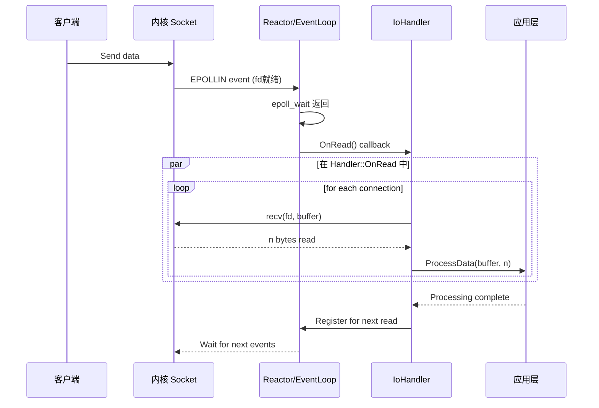
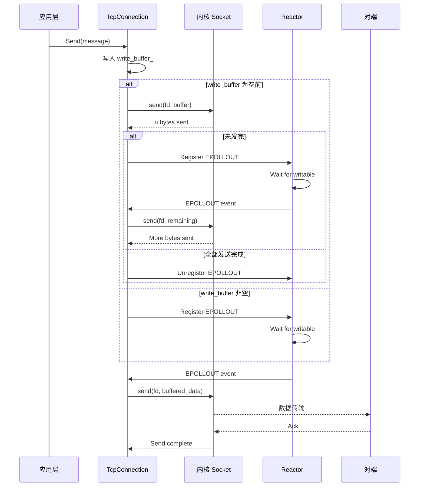
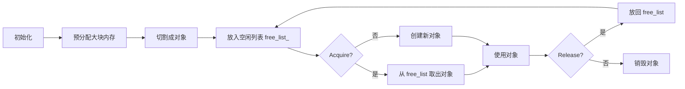
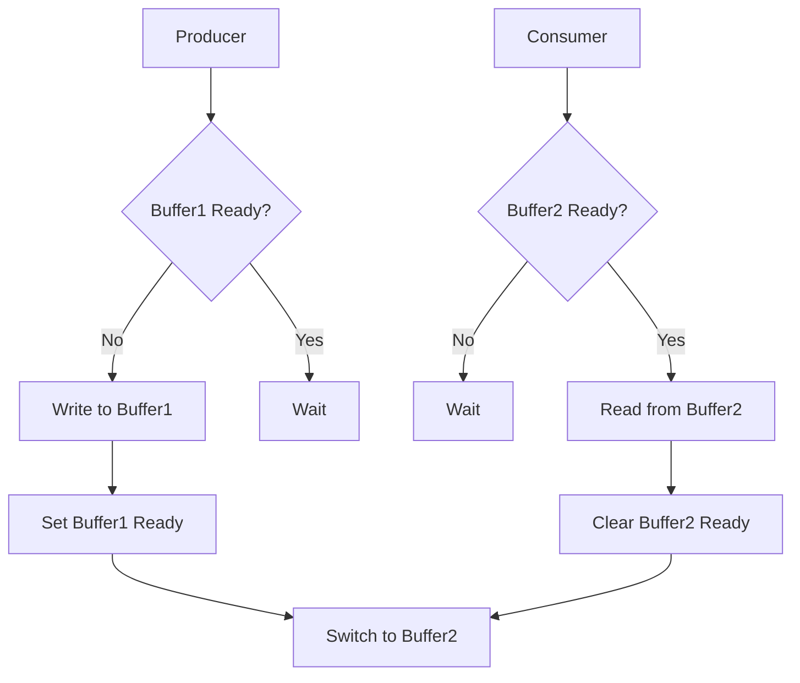
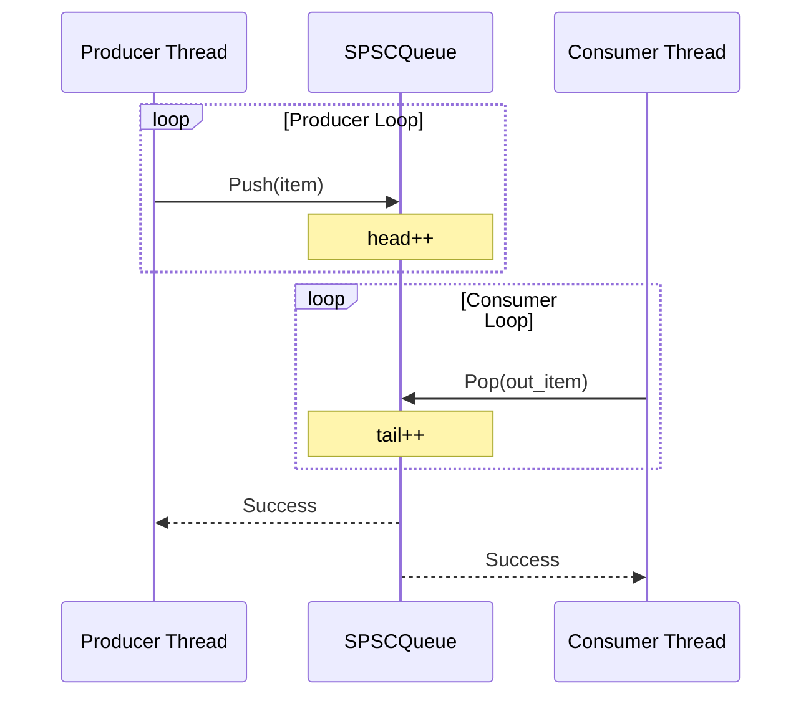
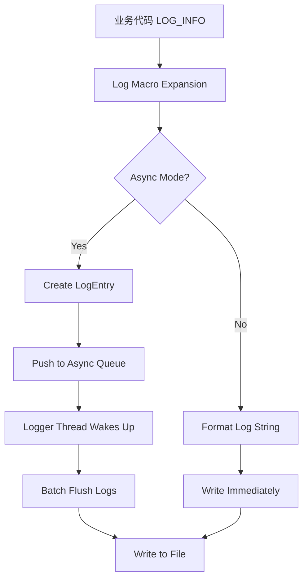
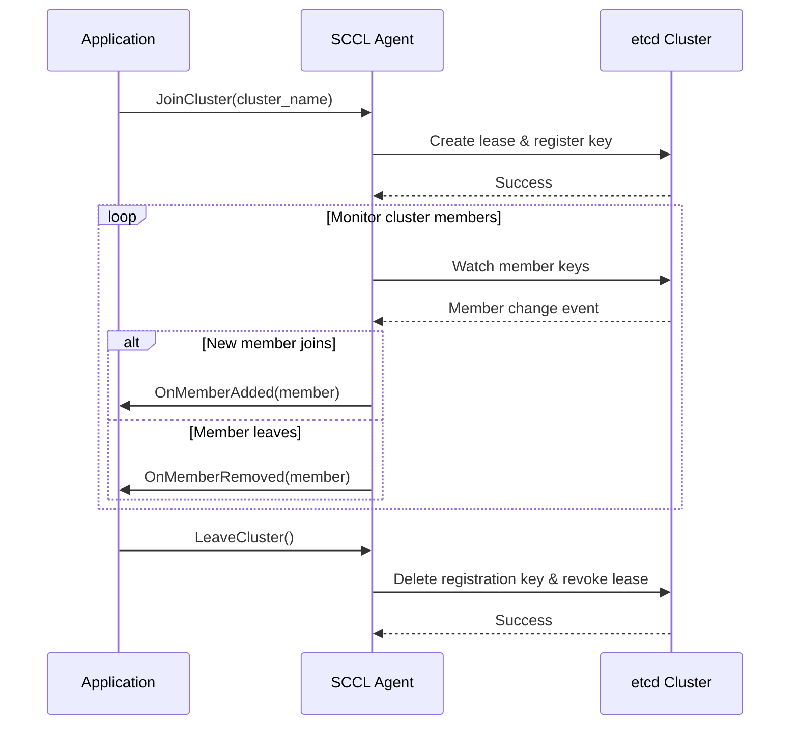
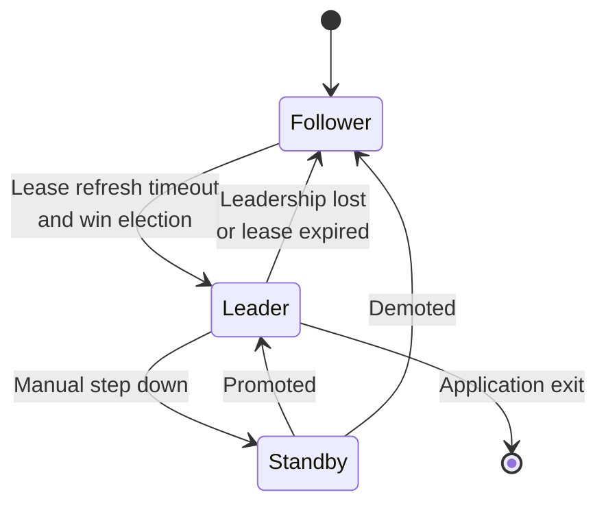
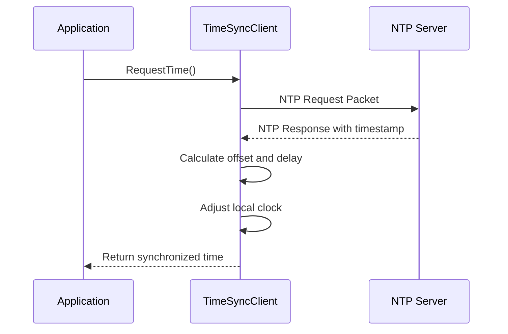
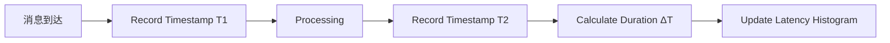

# ADK (Application Development Kit) 数据流转分析报告

## 1. 概述

本文件从数据流角度分析 ADK 中各类数据的流动路径和处理过程，包括网络 IO、内存管理、线程间通信等关键数据路径。

---

## 2. 网络 IO 数据流

### 2.1 接收数据流 (Receiving Path)

#### 2.1.1 Reactor 模式接收流程



**关键实现**:

```cpp
// Reactor::EventLoop 核心循环
void EventLoop::Loop() {
    while (!stopped_) {
        // 1. 等待 IO 事件
        events_.clear();
        int n = reactor_->Wait(events_.data(), events_.size(), kPollTimeoutMs);
        
        if (n > 0) {
            // 2. 分发事件到对应的 Handler
            for (int i = 0; i < n; i++) {
                IoHandler* handler = events_[i].handler;
                
                if (events_[i].revents & EPOLLIN) {
                    // 有数据可读
                    handler->OnRead();
                }
                
                if (events_[i].revents & EPOLLOUT) {
                    // 可写
                    handler->OnWrite();
                }
                
                if (events_[i].revents & EPOLLERR) {
                    // 错误处理
                    handler->OnError();
                }
            }
        }
    }
}

// IoHandler::OnRead 实现
void TcpConnection::OnRead() {
    // 1. 非阻塞读取数据到缓冲区
    ssize_t n = socket_.Recv(read_buffer_.GetWritePtr(), 
                             read_buffer_.WritableBytes());
    
    if (n > 0) {
        // 2. 更新已读指针
        read_buffer_.HasWritten(n);
        
        // 3. 通知应用层处理消息
        OnMessageCallback_(message_callback_, this, &read_buffer_);
        
        // 4. 如果连接关闭，移除事件监听
        if (n == 0) {
            OnConnectionClose();
        }
    } else if (n < 0) {
        if (errno == EAGAIN || errno == EWOULDBLOCK) {
            // 数据已全部读完，等待下次事件
        } else {
            // 错误处理
            OnError(errno);
        }
    }
}
```

#### 2.1.2 边缘触发 (ET) 优化

```cpp
// ET 模式下必须读取完所有数据
void TcpConnection::OnReadET() {
    char buf[65536];
    ssize_t total_read = 0;
    
    while (true) {
        ssize_t n = recv(fd_, buf, sizeof(buf), MSG_DONTWAIT);
        
        if (n > 0) {
            total_read += n;
            buffer_.Append(buf, n);
            
            // 每接收到一部分数据就触发回调
            message_callback_(this, &buffer_);
        } else if (n == 0) {
            // 对端关闭连接
            Close();
            break;
        } else {
            // errno == EAGAIN/EWOULDBLOCK，说明已读完所有数据
            break;
        }
    }
    
    // 记录统计信息
    stats_.total_bytes_received += total_read;
}
```

### 2.2 发送数据流 (Sending Path)

#### 2.2.1 异步发送流程



**关键实现**:

```cpp
// Application layer 调用
void MyApplication::SendMessage(const std::string& msg) {
    connection_->Send(msg);
}

// Connection::Send 实现
void TcpConnection::Send(const Buffer& buffer) {
    // 1. 将数据追加到 write_buffer
    if (buffer.ReadableBytes() > 0) {
        write_buffer_.Append(buffer.Peek(), buffer.ReadableBytes());
        
        // 2. 判断是否需要立即发送
        if (!writing_ && write_buffer_.ReadableBytes() > 0) {
            StartWrite();
        } else if (!writing_) {
            // 之前就在写，但缓冲区满了，注册写事件
            reactor_->RegisterWrite(this);
        }
    }
}

// 开始发送
void TcpConnection::StartWrite() {
    writing_ = true;
    
    do {
        ssize_t n = ::send(fd_, write_buffer_.Peek(), 
                          write_buffer_.ReadableBytes(), MSG_NOSIGNAL);
        
        if (n > 0) {
            // 成功发送部分或全部数据
            write_buffer_.HasRead(n);
            
            if (write_buffer_.ReadableBytes() == 0) {
                // 全部发送完成
                writing_ = false;
                reactor_->UnregisterWrite(this);
                OnWriteComplete();
                break;
            }
            // 继续发送剩余数据
        } else if (errno == EAGAIN || errno == EWOULDBLOCK) {
            // 发送缓冲区满，注册写事件等待可写
            reactor_->RegisterWrite(this);
            writing_ = false;  // 交给事件循环管理
            break;
        } else {
            // 其他错误
            break;
        }
    } while (true);
}
```

### 2.3 Zero-Copy 发送优化

```cpp
// 使用 sendfile 进行零拷贝
ssize_t ZeroCopySend(int fd, int file_fd, size_t size) {
    return sendfile(fd, file_fd, NULL, size);
}

// 使用 writev 批量发送
void BatchSend(int fd, const std::vector<Iovec>& iovs) {
    struct iovec vecs[iovs.size()];
    for (size_t i = 0; i < iovs.size(); i++) {
        vecs[i].iov_base = iovs[i].buffer;
        vecs[i].iov_len = iovs[i].length;
    }
    writev(fd, vecs, iovs.size());
}
```

---

## 3. 内存数据流

### 3.1 内存池生命周期



**实现细节**:

```cpp
// MemPool 的 Allocate 和 Release
template <typename T>
T* MemPool<T>::Allocate() {
    LockGuard guard(mutex_);
    
    T* obj = nullptr;
    
    // 优先从空闲链表获取
    if (!free_list_.empty()) {
        obj = free_list_.front();
        free_list_.pop();
    } else {
        // 没有空闲对象，创建新的
        obj = new T();
    }
    
    ++allocated_count_;
    return obj;
}

template <typename T>
void MemPool<T>::Deallocate(T* obj) {
    if (obj == nullptr) {
        return;
    }
    
    {
        LockGuard guard(mutex_);
        free_list_.push(obj);
    }
    
    --in_use_count_;
    // 注意：不真正 delete，而是放到空闲链表中复用
}
```

### 3.2 共享内存数据流

#### 3.2.1 双缓冲共享内存



**代码实现**:

```cpp
// SharedMemoryChannel 的双缓冲实现
template <typename T>
class SharedMemChannel {
private:
    volatile bool buffer1_ready_;
    volatile bool buffer2_ready_;
    T buffer1_data_;
    T buffer2_data_;
    
public:
    // Producer 端
    template <typename... Args>
    bool Produce(Args&&... args) {
        T& target;
        volatile bool* ready_flag;
        
        // 轮流使用两个缓冲区
        if (!buffer1_ready_) {
            target = buffer1_data_;
            ready_flag = &buffer1_ready_;
        } else if (!buffer2_ready_) {
            target = buffer2_data_;
            ready_flag = &buffer2_ready_;
        } else {
            // 两个缓冲区都被占用，无法写入
            return false;
        }
        
        // 构造对象（完美转发）
        new (&target) T(std::forward<Args>(args)...);
        
        // 同步点
        memory_order_release_store(ready_flag, true);
        
        return true;
    }
    
    // Consumer 端
    bool Consume(T& out) {
        volatile bool* ready_flag = nullptr;
        T* source = nullptr;
        
        if (buffer2_ready_ && !buffer1_ready_) {
            // 消费 buffer2
            ready_flag = &buffer2_ready_;
            source = &buffer2_data_;
            buffer2_ready_ = false;
        } else if (buffer1_ready_ && !buffer2_ready_) {
            // 消费 buffer1
            ready_flag = &buffer1_ready_;
            source = &buffer1_data_;
            buffer1_ready_ = false;
        } else {
            // 无数据可消费
            return false;
        }
        
        out = *source;
        memory_order_acquire_load(ready_flag);
        
        return true;
    }
};
```

### 3.3 消息缓冲区管理

```cpp
// Buffer 类的读写操作
class Buffer {
private:
    char* buffer_;
    size_t capacity_;
    size_t read_pos_;
    size_t write_pos_;
    
public:
    // Append 数据到缓冲区
    void Append(const void* data, size_t len) {
        EnsureWritable(len);
        memcpy(GetWritePtr(), data, len);
        HasWritten(len);
    }
    
    // 读取数据
    void Read(void* data, size_t len) {
        memcpy(data, GetReadPtr(), len);
        HasRead(len);
    }
    
    // 确保有足够的可写空间
    void EnsureWritable(size_t len) {
        if (WritableBytes() < len) {
            MakeSpace(len);
        }
    }
    
    // 标记已写入字节
    void HasWritten(size_t len) {
        assert(ReadableBytes() >= len);
        write_pos_ += len;
    }
    
    // 标记已读取字节
    void HasRead(size_t len) {
        assert(ReadableBytes() >= len);
        read_pos_ += len;
        // 如果读到了末尾，可以 compact 缓冲区
        if (ReadableBytes() <= kCompactThreshold) {
            Compact();
        }
    }
};
```

---

## 4. 线程间通信数据流

### 4.1 SPSC Queue 数据流



**实现原理**:

```cpp
// SPSC Queue 的环形缓冲区实现
template <typename T, size_t Capacity>
class SPSCQueue {
private:
    alignas(64) atomic<size_t> head_;     // Producer only
    alignas(64) atomic<size_t> tail_;     // Consumer only
    T buffer_[Capacity];
    
public:
    bool Push(const T& item) {
        size_t current_head = head_.load(memory_order_relaxed);
        size_t next_head = (current_head + 1) % Capacity;
        
        // 检查队列是否已满
        if (next_head == tail_.load(memory_order_acquire)) {
            return false;  // Queue full
        }
        
        // 写入数据
        buffer_[current_head] = item;
        
        // 发布头指针
        head_.store(next_head, memory_order_release);
        
        return true;
    }
    
    bool Pop(T& out) {
        size_t current_tail = tail_.load(memory_order_relaxed);
        
        // 检查队列是否为空
        if (current_tail == head_.load(memory_order_acquire)) {
            return false;  // Queue empty
        }
        
        // 读取数据
        out = buffer_[current_tail];
        
        // 更新尾指针
        tail_.store((current_tail + 1) % Capacity, memory_order_release);
        
        return true;
    }
};
```

### 4.2 任务提交与执行流


**线程池实现**:

```cpp
template <typename Func>
void ThreadPool::Submit(Func&& func) {
    {
        // 加锁
        boost::mutex::scoped_lock lock(mutex_);
        
        // 创建包装后的 task
        tasks_.push(std::forward<Func>(func));
        
        // 通知工作线程
        condition_.notify_one();
    }
}

// Worker thread 循环
void ThreadPool::WorkerThread() {
    while (running_) {
        Task task;
        
        {
            boost::unique_lock<boost::mutex> lock(mutex_);
            
            // 等待任务
            condition_.wait(lock, [this]{ 
                return !running_ || !tasks_.empty(); 
            });
            
            if (!running_ && tasks_.empty()) {
                return;
            }
            
            // 取出任务
            task = std::move(tasks_.front());
            tasks_.pop();
        }
        
        // 执行任务（释放锁的情况下）
        task();
    }
}
```

---

## 5. 日志数据流

### 5.1 异步日志流水线



**实现**:

```cpp
// 异步日志实现
class AsyncLogger {
private:
    LoggerThread logger_thread_;
    BlockingQueue<LogEntry> log_queue_;
    
public:
    void Log(LogLevel level, const char* file, int line, const char* format, ...) {
        LogEntry entry;
        entry.level = level;
        entry.file = file;
        entry.line = line;
        entry.thread_id = GetCurrentThreadId();
        
        // 格式化日志内容
        va_list args;
        va_start(args, format);
        vsnprintf(entry.buffer, sizeof(entry.buffer), format, args);
        va_end(args);
        
        // 入队
        log_queue_.Push(entry);
    }
    
private:
    void LoggerThreadFunc() {
        while (running_) {
            LogEntry entry;
            
            if (log_queue_.PopWithTimeout(entry, 100ms)) {
                // 批量写入文件
                WriteToFile(entry);
            }
        }
    }
};
```

---

## 6. SCCL 集群状态流转

### 6.1 集群成员变化流程



### 6.2 Leader 选举数据流



**代码实现**:

```cpp
// SCCL Leader Election state machine
class ScclLeaderElection {
private:
    enum class Role { FOLLOWER, LEADER, STAND_BY };
    Role current_role_;
    boost::timer lease_timer_;
    
public:
    void OnLeaseRefreshed() {
        if (current_role_ == Role::LEADER) {
            // 继续作为 Leader，刷新 lease
            RefreshLeadership();
        } else if (current_role_ == Role::FOLLOWER) {
            // 尝试竞选 Leader
            TryBecomeLeader();
        }
    }
    
    void TryBecomeLeader() {
        // 竞争 Leader 职位
        if (win_election_) {
            SetRole(Role::LEADER);
            OnBecomeLeader();
        }
    }
    
    void SetRole(Role role) {
        if (role != current_role_) {
            Role old_role = current_role_;
            current_role_ = role;
            
            // 通知应用层
            NotifyRoleChange(old_role, role);
        }
    }
};
```

---

## 7. 时间同步数据流

### 7.1 NTP 时钟同步



**实现**:

```cpp
class TimeSyncClient {
private:
    UDPsocket ntp_socket_;
    double last_offset_;
    bool sync_initialized_;
    
public:
    int64_t GetSynchronizedTime() {
        // 定期与 NTP server 同步
        if (!sync_initialized_ || ShouldSyncAgain()) {
            SyncWithNTP();
        }
        
        // 返回经过偏移校正的时间
        return GetCurrentTimeWithOffset();
    }
    
private:
    void SyncWithNTP() {
        uint32_t ntp_request[4] = {0};
        
        // 发送 NTP 请求
        ntp_socket_.Send(ntp_request, sizeof(ntp_request), ntp_server_);
        
        // 接收响应
        uint32_t ntp_response[4];
        ntp_socket_.Receive(ntp_response, sizeof(ntp_response));
        
        // 计算时间偏移
        int64_t receive_time = GetLocalTimeMicros();
        int64_t offset = CalculateOffset(ntp_response[2], ntp_response[3], receive_time);
        
        // 平滑调整（避免剧烈跳变）
        last_offset_ = alpha_filter_(last_offset_, offset);
        
        sync_initialized_ = true;
    }
    
    int64_t GetCurrentTimeWithOffset() {
        int64_t now = GetLocalTimeMicros();
        return now + static_cast<int64_t>(last_offset_);
    }
};
```

---

## 8. 性能相关数据流

### 8.1 延迟测量链路



**实现**:

```cpp
class LatencyTracker {
private:
    std::atomic<uint64_t> total_latency_us_;
    std::atomic<uint64_t> sample_count_;
    LatencyHistogram histogram_;
    
public:
    int64_t RecordOperation(std::function<void()> operation) {
        int64_t start_ts = adk::timespec_now();  // T1
        
        operation();
        
        int64_t end_ts = adk::timespec_now();   // T2
        int64_t duration_us = end_ts - start_ts;
        
        // 统计
        total_latency_us_.fetch_add(duration_us);
        sample_count_.fetch_add(1);
        histogram_.Record(duration_us);
        
        return duration_us;
    }
};
```

---

## 9. 总结

ADK 中的数据流转特点:

| 数据类型 | 主要路径 | 关键技术 | 性能关注点 |
|---------|---------|---------|-----------|
| 网络接收 | Kernel→Reactor→Handler→App | epoll、非阻塞 IO | 零拷贝、批量处理 |
| 网络发送 | App→Buffer→Kernel | async send、sendfile | 合并发送、减少系统调用 |
| 内存分配 | Pool→Object→Use→Return | Object Pool | 避免碎片、提高复用 |
| 跨进程通信 | SharedMem Channel | 双缓冲区 | 避免复制、原子操作 |
| 线程通信 | SPSC Queue | 无锁队列 | 缓存友好、低延迟 |
| 日志记录 | LogEntry→AsyncQueue→File | 异步写入 | 批量 flush、减少 IO |
| 时间同步 | NTP Server→Clock Offset | NTP protocol | 精确度、平滑滤波 |

这些数据流的设计目标是：
1. **高性能**: 最小化拷贝和系统调用
2. **低延迟**: 使用无锁结构和高效算法
3. **高吞吐**: 批量处理和零拷贝技术
4. **可靠性**: 异常处理和故障隔离
